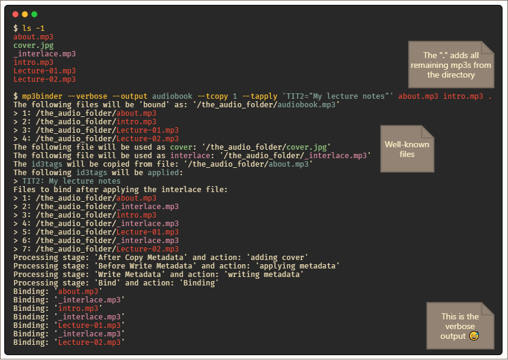

# About

_mp3binder_ joins multiple MP3[^1] files into one without re-encoding. It writes ID3v2 tags and chapters[^2] for each file.

## Why?

Older mp3players (e.g. simple stereos for children), are not always capable of playing multiple files in the correct order. Joining them into one file removes this limitation. Or sometimes a single mp3 file is more practical than a directory of files.

## How

This tool builds upon [Darren Mulholland](https://github.com/dmulholl)'s wonderfully simple [mp3cat](https://github.com/dmulholl/mp3cat) with the corresponding low-level library [mp3lib](https://github.com/dmulholl/mp3lib) which performs all the heavy lifting. The tool adds id3v2 tag support with the help of the [id3v2](https://github.com/bogem/id3v2) library by [Albert Nigmatzianov](https://github.com/bogem).

# Features

_mp3binder_:

- combines multiple mp3 files **without re-encoding**
- can embed a **cover image** (jpeg, png) to the output file
  - either via the command line option: `--cover`
  - or by copying from an input file, e.g. the first file: `--tcopy 1`
  - or automatically if the folder of the mp3 files contain a `folder.jpg` or `cover.jpg` file
  - the automation can be disabled with the command line option `--nodiscovery`
- can add **files between each files** (e.g. silence)
  - either via the command line option: `--interlace`
  - or automatically if the folder of the mp3 files contain a `_interlace.mp3` file
  - the automation can be disabled with the command line option `--nodiscovery`
- can write **chapters** based on the id3v2 title of the input files
  - it can be disabled with the command line option: `--nochapters`
- can write **id3v2 tags** to the output file via the command line option: `--tapply 'TIT2="My Title",TALB="My album"'`
  - the key can be any valid tag from the [id3v2 standard](https://id3.org/id3v2.3.0#Declared_ID3v2_frames)

# Screenshot



_Note: color added for clarity_

# Usage

```
mp3builder joins multiple MP3 files into one without re-encoding.
It writes ID3v2 tags and chapters for each file.

Usage:
  mp3builder file1.mp3 file2.mp3 [flags]

Examples:
Calling 'mp3builder' with no parameters in the directory containing the mp3 files
is equivalent to: 'mp3builder .', which is the same as 'mp3builder *.mp3' and
binds all mp3 files to 'foldername.mp3'.

Flags:
      --nodiscovery        no discovery for well-known files (e.g. cover.jpg)
      --nochapters         does not write chapters for bounded files
      --cover string       use image file as artwork
      --verbose            prints verbose information for each processing step
      --force              overwrite an existing output file
      --interlace string   interlace a spacer file (e.g. silence) between each input file
      --output string      output filepath. Defaults to name of the folder of the first file provided
      --tapply string      apply id3v2 tags to output file.
                           Takes the format: 'key1="value",key2="value"'.
                           Keys should be from https://id3.org/id3v2.3.0#Declared_ID3v2_frames
      --tcopy int          copy the ID3 metadata tag from the n-th input file, starting with 1
      --lang string        ISO-639 language string used during string manipulation
                           (e.g. uppercasing non-english languages) (default "en-GB")
  -h, --help               help for mp3builder
  -v, --version            version for mp3builder
```

# Examples

Files to be merged can be specified as a list of filenames:

`$ mp3binder one.mp3 two.mp3 three.mp3`

Alternatively, an entire directory of .mp3 files can be merged:

- `$ mp3binder` or `$ mp3binder .` (the current directory is used)
- `$ mp3binder foo` (the files in the 'foo' directory are used)
- `$ mp3binder *.mp3` (the shell expands all mp3 files as individual shell-sorted parameters)

ID3 tags can be copied from the n-th input file:

`$ mp3binder --tcopy 1 one.mp3 two.mp3 three.mp3`

ID3 tags could also be set manually. The name of the tag must be according to https://id3.org/id3v2.3.0#Declared_ID3v2_frames:

- `$ mp3binder . --tcopy 1 --tapply "TRCK=42,TIT2='My sample title'"`
- `$ mp3binder . --tapply "TIT2=\"It's like that\""`

Please notice the surrounding quotes and ensure proper quoting.

# Silence between each tracks via interlace file

Based on: http://activearchives.org/wiki/Padding_an_audio_file_with_silence_using_sox

Create a silence track: `sox -n -r 44100 -c 2 silence.mp3 trim 0.0 3.0`

If the input material is FBR (fixed bit rate), generate the silence track with the same fixed bit rate using the '-C' option: `sox -n -r 44100 -c 2 -C 192 silence.mp3 trim 0.0 3.0`. The shell command `file one.mp3` gives information about the bit rate of a file.

And apply: `mp3bind --interlace silence.mp3 01.mp3 02.mp3`

# Build instructions

Building is always more complex then just calling `build` (e.g. adding version information into the binary or naming the binary or optimize the binary by stripping debug information). Instead of a `Makefile`, a `Taskfile.yml` is used that holds the instructions for [Task](https://taskfile.dev). 'Task' is not mandatory but simplifies the workflow. Once installed ([instructions](https://taskfile.dev/#/installation)), 'Task' provides an executable `task` that can be called with custom actions.

For example cross compilation for multiple platforms is achieved with `task build-all`, and for the current platform with `task build`. Plain go would be: `go build .\cmd\tui\` without build time optimizations and settings (e.g. version information).

The `Taskfile.yml` gives good hints which commands and options are executed if the developer don't want to use `task`. In the end 'Task' it's just a simple task runner (collection of commands).


### Install golang manually

```
go install golang.org/dl/go1.18@latest
go1.18rc1 download
```

```
export set PATH=~/go/bin:$PATH
alias go=go1.18
```
### Install latest gopls

1. Either in Codium / VS Studio Code: "Go: Install/Update Tools"

2. Or manually. Example for POSIX based systems:

```
mkdir /tmp/gopls && cd "$_"
gotip mod init gopls-unstable
gotip get golang.org/x/tools/gopls@master golang.org/x/tools@master
gotip install golang.org/x/tools/gopls
```

### Configure VSCode/Codium

1. View > Command Palette
2. Go: choose Go environment
3. select go1.18rc1

[^1]: formally: MPEG-1 Audio Layer III or MPEG-2 Audio Layer III
[^2]: [specification](https://id3.org/id3v2-chapters-1.0)
